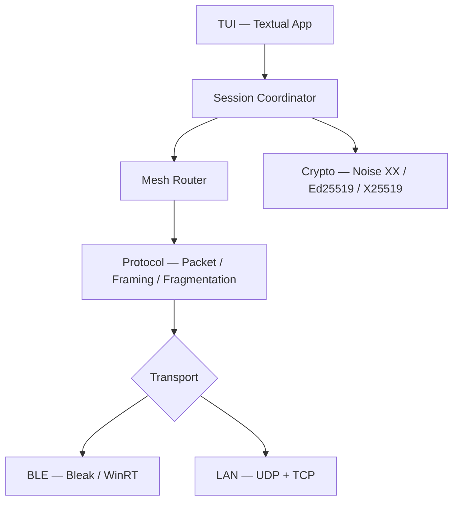

<div align="center">

# BitChat Python

**Encrypted peer-to-peer mesh chat over Bluetooth Low Energy and LAN**

*Terminal-native · No servers · No accounts · No internet required*

[](https://github.com/Java-Mx/bitchat-python/actions/workflows/ci.yml)
[](https://www.python.org/)
[](LICENSE)

</div>

BitChat Python is an asynchronous terminal client implementing the [BitChat](https://github.com/vaibhav-mattoo/bitchat-tui) protocol. Nodes discover each other over Bluetooth Low Energy or local Wi-Fi, negotiate authenticated Noise XX sessions, and exchange end-to-end encrypted messages across a self-forming multi-hop mesh — no infrastructure required.

---

## Architecture



| Layer | Modules |
|---|---|
| Terminal UI | `tui/` — Textual app, widgets, modals, autocomplete |
| Orchestration | `app/` — `SessionCoordinator`, `Application`, config |
| Mesh routing | `mesh/` — `MeshRouter`, deduplication, store-and-forward |
| Cryptography | `crypto/` — Noise XX, Ed25519, X25519, AES-GCM, HKDF, PBKDF2 |
| Protocol | `protocol/` — packet encoding/decoding, fragmentation, reassembly |
| Transport | `transport/` + `ble/` + `network/` — BLE and LAN backends |

---

## Transports

### Bluetooth Low Energy

- **Central** — scans for peers advertising the BitChat GATT service UUID
- **Peripheral / GATT server** — advertises and accepts inbound connections
- Automatic MTU fragmentation: packets > 500 B split into ≤ 150 B fragments, paced at 20 ms intervals
- Platform note: GATT peripheral advertising requires hardware and driver support. On some Windows configurations (e.g. certain Intel adapters) the radio supports Central scanning but the OS does not grant GATT host access to third-party applications. BitChat detects this and falls back gracefully — Central scanning and LAN remain available.

### LAN / Wi-Fi

- **UDP discovery** (port 41234) — zero-config broadcast beacons (`BC_DISCOVER_V1`), 10 pkts/s rate limit, 30 s peer TTL
- **Framed TCP** (port 41235) — 8-byte length-prefix framing (`BC\x01\x00` magic + 4-byte big-endian length), 64 KB frame limit
- Supports up to 32 concurrent peer connections

### Runtime switching

Switch transport at any time: `/transport lan` or `/transport bluetooth` (also via Settings `F3`).
Switching generates a fresh ephemeral identity and tears down all active sessions — previous sessions are not linkable to the new transport identity.

---

## Cryptography

```
Ed25519 keypair  ──── identity / signatures
     │
     ▼
Noise XX  (Noise_XX_25519_ChaChaPoly_SHA256)
  ├── X25519        key agreement
  ├── SHA-256       Noise hash / chaining
  ├── HKDF-SHA256   key derivation within handshake
  └── ChaCha20-Poly1305  session AEAD (1024-entry replay window)

Legacy / channel encryption
  ├── AES-256-GCM   direct-message legacy path
  └── PBKDF2-HMAC-SHA256  channel key derivation
```

All key material is generated locally. No key escrow. No third-party servers.
Identity persists to `~/.bitchat/identity.json` (mode `0600` on POSIX; restricted ACL on Windows). This is access control, not encryption of the key file.

> See [`docs/security/CRYPTOGRAPHY.md`](docs/security/CRYPTOGRAPHY.md) and [`docs/security/NOISE.md`](docs/security/NOISE.md) for detailed protocol documentation.

---

## Platform support

| Platform | BLE Central | BLE Peripheral / GATT | LAN |
|---|:---:|:---:|:---:|
| Windows 10 / 11 | ✓ | Hardware/driver dependent | ✓ |
| Linux (BlueZ) | ✓ | ✓ | ✓ |
| macOS 12+ | ✓ | ✓ | ✓ |

**Physical two-machine validation** — automated integration tests (including two-node Noise XX over simulated BLE and over framed TCP) pass in CI. Real over-the-air validation across two separate physical machines is not yet confirmed.

---

## Installation

### Requirements

- Python 3.12+
- Git

For BLE on Linux: BlueZ (`bluez`, `dbus`). For BLE on macOS: Bluetooth permission granted to your terminal. For LAN: any local network.

### With `uv` (recommended)

```bash
git clone https://github.com/Java-Mx/bitchat-python.git
cd bitchat-python
uv sync
uv run bitchat
```

### With `pip`

```bash
git clone https://github.com/Java-Mx/bitchat-python.git
cd bitchat-python
python -m venv .venv
# Windows:   .venv\Scripts\Activate.ps1
# Unix:      source .venv/bin/activate
pip install -e .
bitchat
```

---

## Quick start

```
$ uv run bitchat          # interactive TUI (default)
$ uv run bitchat --cli    # headless / scripted mode
```

On first launch, an Ed25519 identity is generated and saved to `~/.bitchat/identity.json`.

The TUI opens with:
- **Header** — connection state, action bar (`F1` Help · `F2` Theme · `F3` Settings)
- **Left panel** — discovered and connected peers, RSSI or IP displayed
- **Chat pane** — conversation log with encryption indicators
- **Status bar** — transport state, active channel, peer count

---

## Commands

| Command | Usage | Description |
|---|---|---|
| `/name` | `/name <nick>` | Set nickname and announce to peers |
| `/transport` | `/transport bluetooth\|lan` | Switch transport and generate fresh identity |
| `/scan` | `/scan` | Trigger active peer discovery |
| `/connect` | `/connect [addr\|nick]` | Connect to a peer, or list discovered peers |
| `/disconnect` | `/disconnect [addr]` | Disconnect peer(s) |
| `/online` | `/online` | List connected and discovered peers |
| `/dm` | `/dm <peer> <msg>` | Send Noise XX encrypted direct message |
| `@<peer>` | `@<peer> [msg]` | Send DM or switch conversation context |
| `/public` | `/public` | Return to `#public` broadcast channel |
| `/info` | `/info <peer>` | Show peer key fingerprint and session state |
| `/status` | `/status` | Transport, mesh, and security diagnostics |
| `/settings` | `/settings` | Open settings modal (`F3`) |
| `/edit` | `/edit` | Open theme editor (`F2`) |
| `/clear` | `/clear` | Clear chat log |
| `/help` | `/help` | Show help screen (`F1`) |
| `/exit` | `/exit` | Quit BitChat |

**Keyboard shortcuts** (all remappable in Settings):

| Key | Action |
|---|---|
| `F1` | Help screen |
| `F2` | Theme / appearance editor |
| `F3` | Settings and keybinding editor |
| `Ctrl+L` | Clear chat |
| `Ctrl+Q` | Quit |
| `PageUp / PageDown` | Scroll chat history |
| `Ctrl+Shift+P` | Textual command palette |

---

## Features

| Feature | Status |
|---|---|
| BLE Central scanning | ✓ |
| BLE Peripheral / GATT advertising | ✓ (hardware-dependent on Windows) |
| BLE MTU fragmentation & reassembly | ✓ |
| LAN UDP discovery | ✓ |
| LAN framed TCP transport | ✓ |
| Runtime transport switching | ✓ |
| Ed25519 identity & signatures | ✓ |
| X25519 key agreement | ✓ |
| Noise XX handshake | ✓ |
| ChaCha20-Poly1305 sessions | ✓ |
| AES-256-GCM legacy path | ✓ |
| HKDF-SHA256 key derivation | ✓ |
| PBKDF2 channel keys | ✓ |
| Replay window (1024 entries) | ✓ |
| Multi-hop mesh routing (TTL 7) | ✓ |
| Packet deduplication | ✓ |
| Store-and-forward queue | ✓ |
| Persistent identity storage | ✓ |
| Ephemeral transport identity switching | ✓ |
| Terminal UI (Textual) | ✓ |
| Dynamic keybindings | ✓ |
| Theme / density / accent customization | ✓ |
| Command autocomplete palette | ✓ |
| BLE → LAN fallback modal | ✓ |
| Persistent message database | Planned |

---

## Project structure

```
src/bitchat/
├── app/        session coordinator, application bootstrap, config
├── ble/        Bluetooth transport — adapter, scanner, GATT server, connection
├── network/    LAN transport — UDP discovery, TCP framing, server, adapter
├── transport/  abstract BaseTransport, BluetoothTransport, type definitions
├── protocol/   packet encoding/decoding, fragmentation, reassembly, constants
├── crypto/     Ed25519, X25519, Noise XX, AES-GCM, HKDF, PBKDF2, sessions
├── mesh/       MeshRouter, PacketDeduplicator, StoreAndForwardQueue
├── commands/   command registry and parser
├── storage/    AppConfig, FileConfigStorage, identity persistence
└── tui/        Textual app, screens (modals), widgets, styles

tests/
├── ble/        BLE mock backends, adapter, scanner, server, transport tests
├── crypto/     Ed25519, X25519, Noise XX, AES-GCM, HKDF, PBKDF2, sessions
├── network/    LAN framing, discovery, connection, adapter tests
├── protocol/   packet, encoder, decoder, fragmentation, reassembly, security
├── unit/       TUI, session coordinator, mesh, commands, transport switch
├── integration/  end-to-end BLE and LAN two-node tests
└── interoperability/  Nim/Rust protocol vector tests

docs/
├── protocol/   packet format, message types, routing, fragmentation, compatibility
├── security/   cryptography, Noise protocol, threat model
└── platform/   Windows, Linux, macOS setup guides
```

---

## Development

```bash
# Install all dependencies including dev/test tools
uv sync --all-groups

# Run the test suite
uv run pytest

# Type checking
uv run pyright

# Linting and format check
uv run ruff check .
uv run ruff format --check .
```

**658 tests** covering protocol, crypto, BLE mocks, LAN, mesh routing, TUI lifecycle, and integration scenarios. CI runs on Python 3.12 and 3.13 via GitHub Actions on every push and pull request.

---

## Platform setup notes

<details>
<summary>Linux (BlueZ)</summary>

```bash
# Debian / Ubuntu
sudo apt update && sudo apt install -y bluez dbus

# Arch
sudo pacman -S bluez bluez-utils

sudo systemctl enable --now bluetooth
sudo usermod -aG bluetooth $USER
rfkill unblock bluetooth
```

</details>

<details>
<summary>macOS</summary>

Allow Bluetooth access for your terminal emulator when macOS prompts on first launch.
If previously denied: **System Settings → Privacy & Security → Bluetooth** → enable your terminal.

</details>

<details>
<summary>Windows</summary>

Enable Bluetooth in **Settings → Bluetooth & devices**.
BitChat uses native WinRT APIs — no extra drivers required.
If GATT peripheral advertising fails (status 3 / Aborted), the BLE warning modal offers a LAN fallback. Central scanning continues regardless.

</details>

---

## Security

This project has not undergone a formal third-party security audit. Do not use for high-risk communications.

See [SECURITY.md](SECURITY.md) for the vulnerability reporting policy and [docs/security/THREAT_MODEL.md](docs/security/THREAT_MODEL.md) for the threat model.

---

## Reference implementation

Protocol reference: [bitchat-tui](https://github.com/vaibhav-mattoo/bitchat-tui) (Rust). This repository targets protocol compatibility but does not use Rust code or the Rust runtime.

---

## License

[MIT](LICENSE)
