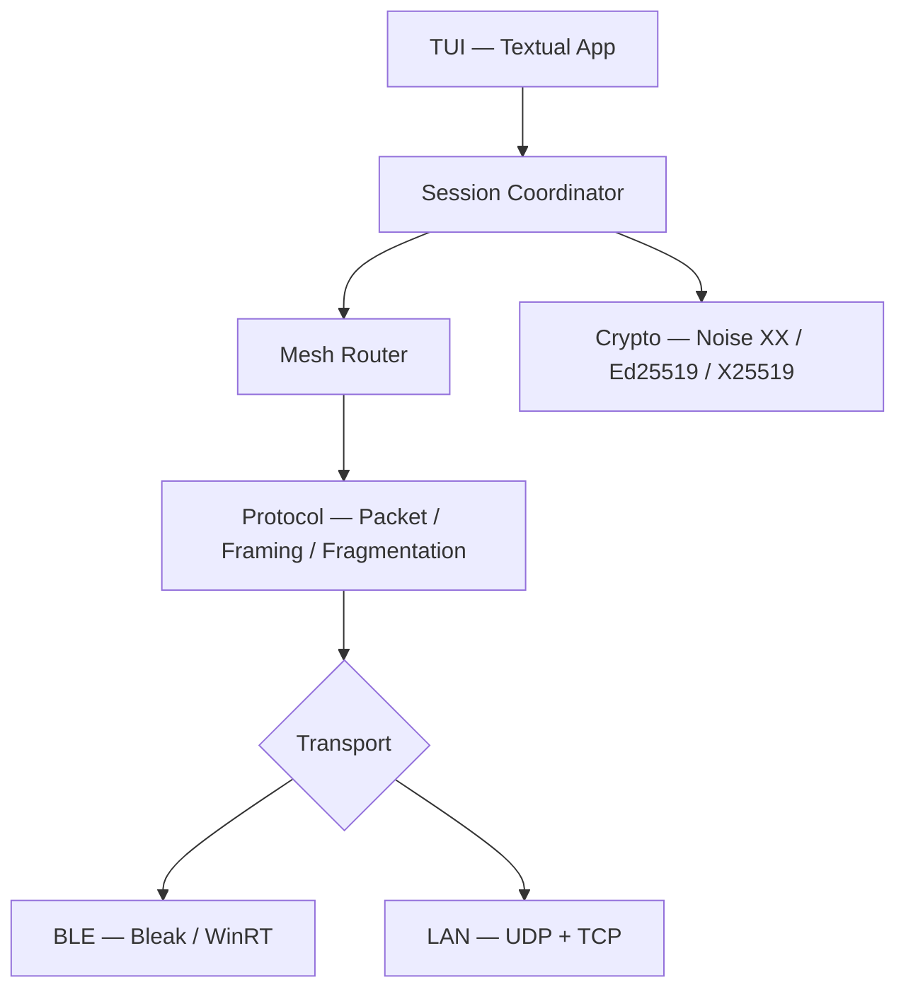

<div align="center">

# BitChat Python

**Encrypted peer-to-peer mesh chat over Bluetooth Low Energy and LAN**

*Terminal-native · No servers · No accounts · No internet required*

[](https://github.com/Java-Mx/bitchat-python/actions/workflows/security.yml)
[](https://www.python.org/)
[](LICENSE)
[](https://docs.astral.sh/ruff/)
[](https://github.com/microsoft/pyright)
[](https://github.com/Java-Mx/bitchat-python/blob/main/.github/dependabot.yml)
[](https://github.com/Java-Mx/bitchat-python/commits/main)
[](https://github.com/Java-Mx/bitchat-python)
[](https://github.com/Java-Mx/bitchat-python/issues)
[](https://github.com/Java-Mx/bitchat-python/graphs/contributors)
[](https://github.com/Java-Mx/bitchat-python/stargazers)
[](https://github.com/Java-Mx/bitchat-python/network/members)

</div>

BitChat Python is an asynchronous terminal client implementing the [BitChat](https://github.com/vaibhav-mattoo/bitchat-tui) protocol. Nodes discover each other over Bluetooth Low Energy or local Wi-Fi, negotiate authenticated Noise XX sessions, and exchange end-to-end encrypted messages across a self-forming multi-hop mesh — no infrastructure required.

---

## Contents

- [Quick Start](#quick-start)
- [Installation](#installation)
  - [Windows](#windows)
    - [WinGet](#winget)
    - [GitHub Release Installer](#github-release-installer)
    - [Source & Developer Install](#source--developer-install)
  - [Linux](#linux)
  - [macOS](#macos)
- [Verify Installation](#verify-installation)
- [Troubleshooting Installation](#troubleshooting-installation)
- [Commands](#commands)
- [Features](#features)
- [Architecture](#architecture)
- [Transports](#transports)
- [Cryptography](#cryptography)
- [Platform Support](#platform-support)
- [Troubleshooting](#troubleshooting)
- [Project Structure](#project-structure)
- [Development](#development)
- [Security](#security)
- [License](#license)

---

## Quick Start

### Windows (Fastest)

Download and run the standalone installer from [GitHub Releases](https://github.com/Java-Mx/bitchat-python/releases):
```powershell
# Or via WinGet once published upstream:
winget install Java-Mx.BitChat

# Launch immediately:
bitchat
```

### Linux & macOS (Python / Source)

```bash
git clone https://github.com/Java-Mx/bitchat-python.git
cd bitchat-python
uv sync
uv run bitchat
```

---

## Installation

BitChat provides dedicated distribution channels tailored for each platform:
- **Windows:** Self-contained native installer and WinGet package (no separate Python or venv required).
- **Linux:** Native Python / pip / virtual environment (BlueZ D-Bus integration).
- **macOS:** Native Python / pip / virtual environment (CoreBluetooth integration).

*(Note: WinGet is Windows-only and does not install Linux or macOS packages).*

---

### Windows

#### WinGet

> [!NOTE]
> **Status:** WinGet submission: pending Microsoft review ([microsoft/winget-pkgs#443445](https://github.com/microsoft/winget-pkgs/pull/443445)).
> Official WinGet manifests are prepared and validated in the repository at [`manifests/j/Java-Mx/BitChat/0.1.0/`](manifests/j/Java-Mx/BitChat/0.1.0/).
> The public command `winget install Java-Mx.BitChat` becomes available once the manifest pull request is merged into Microsoft's community repository ([microsoft/winget-pkgs](https://github.com/microsoft/winget-pkgs)).
> Until upstream review is complete, use the **GitHub Release Installer** below or install directly from the local repository manifest.

Once accepted into Microsoft's official WinGet repository:
```powershell
winget install Java-Mx.BitChat
```

To test or install directly from this repository's local manifest:
```powershell
winget install --manifest manifests/j/Java-Mx/BitChat/0.1.0/
```

**Upgrade:**
```powershell
winget upgrade Java-Mx.BitChat
```

**Uninstall:**
```powershell
winget uninstall Java-Mx.BitChat
```

#### GitHub Release Installer

The self-contained Windows executable installer bundles the Python runtime, BitChat package, Bleak Bluetooth stack, and native cryptographic libraries into a single setup program. No Python installation or virtual environment is needed.

1. Download `BitChat-<version>-windows-x64.exe` from [GitHub Releases](https://github.com/Java-Mx/bitchat-python/releases).
2. Run the installer. It supports both an interactive setup wizard and silent unattended installations.
3. The installer automatically adds BitChat to your user `PATH`.
4. Open a PowerShell or Command Prompt terminal and launch:
   ```powershell
   bitchat
   ```

#### Source & Developer Install

If you prefer developing on Windows or running from source:

**Requirements:** Windows 10 version 1903+ or Windows 11, Python 3.12 or 3.13.

```powershell
# Clone the repository
git clone https://github.com/Java-Mx/bitchat-python.git
cd bitchat-python

# Using uv (recommended)
uv sync
uv run bitchat

# Or with pip in a virtual environment:
py -3.12 -m venv .venv
.\.venv\Scripts\Activate.ps1
pip install --upgrade pip
pip install -e .
bitchat
```

### Windows Bluetooth notes

- BitChat uses Windows WinRT Bluetooth APIs — no third-party drivers required.
- Enable Bluetooth in **Settings → Bluetooth & devices**.
- BLE Central scanning works on all standard BLE adapters.
- GATT peripheral hosting (advertising a server to inbound connections) requires driver and hardware support. Some adapter/driver combinations report `IsPeripheralRoleSupported = True` but fail when BitChat calls `GattServiceProvider.RequestAccess()`. This is normal and not a bug in BitChat — see [Troubleshooting](#gatt-service-advertising-failed-with-status-3) below.
- LAN transport requires no special configuration beyond a working Wi-Fi or Ethernet connection.

---

## Linux

BitChat provides native, sandboxed, and portable Linux distributables that bundle all runtime dependencies (CPython runtime, Textual TUI, Bleak BLE stack, and Cryptography). Manual Python or pip installation is not required.

### Recommended

#### Flatpak (Flathub)

> [!NOTE]
> **Status:** Flatpak packaging: configured and validated in [`packaging/linux/flatpak/`](packaging/linux/flatpak/).
> Flathub submission is tracked under the reverse-DNS identifier `io.github.java_mx.bitchat`.
> Built packages can be installed locally via `flatpak-builder`.

Flatpak delivers a secure, containerized sandbox adhering strictly to the principle of least privilege:
- BlueZ system D-Bus access (`--system-talk-name=org.bluez`) for BLE mesh communication.
- Network access (`--share=network`) for LAN discovery (UDP port 24024) and TCP messaging (port 24025).
- No unconfined host filesystem access (`--filesystem=host` is not requested).

To build and run the Flatpak locally:
```bash
flatpak install flathub org.freedesktop.Platform//24.08 org.freedesktop.Sdk//24.08
flatpak-builder --user --install --force-clean build-dir packaging/linux/flatpak/io.github.java_mx.bitchat.yaml
flatpak run io.github.java_mx.bitchat
```

To uninstall:
```bash
flatpak uninstall io.github.java_mx.bitchat
```

---

### Debian / Ubuntu (.deb)

The primary native package for Debian, Ubuntu, Linux Mint, Pop!_OS, and derivatives. Installs the self-contained executable to `/usr/lib/bitchat`, integrates the `/usr/bin/bitchat` launcher, and adds desktop application shortcuts.

1. Download `bitchat_<version>_amd64.deb` and its SHA-256 checksum from [GitHub Releases](https://github.com/Java-Mx/bitchat-python/releases).
2. Install via `apt` (automatically handles system permissions):
   ```bash
   sudo apt install ./bitchat_<version>_amd64.deb
   ```
3. Launch BitChat directly from any terminal or application launcher:
   ```bash
   bitchat
   ```
4. Verify system hardware and transport capabilities:
   ```bash
   bitchat --configure
   ```
5. To uninstall cleanly:
   ```bash
   sudo apt remove bitchat
   ```

---

### Universal Portable (AppImage)

A standalone universal executable that runs on any modern 64-bit Linux distribution without installation or root privileges.

1. Download `BitChat-<version>-x86_64.AppImage` from [GitHub Releases](https://github.com/Java-Mx/bitchat-python/releases).
2. Grant execution permissions:
   ```bash
   chmod +x BitChat-<version>-x86_64.AppImage
   ```
3. Run BitChat:
   ```bash
   ./BitChat-<version>-x86_64.AppImage
   ```
4. Check version or run hardware diagnostics:
   ```bash
   ./BitChat-<version>-x86_64.AppImage --version
   ./BitChat-<version>-x86_64.AppImage --configure
   ```

---

### Snap (Evaluated / Secondary Target)

> [!NOTE]
> **Status:** Snapcraft configuration is maintained in [`packaging/linux/snap/`](packaging/linux/snap/).
> Because the Canonical Snap Store classifies the `bluez` D-Bus interface as sensitive, strictly confined snaps require manual interface authorization (`sudo snap connect bitchat:bluez`) unless granted an official store declaration. Snap is maintained as a secondary packaging target.

```bash
cd packaging/linux/snap
snapcraft
sudo snap install bitchat_*.snap --dangerous
sudo snap connect bitchat:bluez
bitchat
```

---

### From Source (Developers)

**Requirements:** Python 3.12 or 3.13, BlueZ 5.43+, D-Bus development headers.

#### 1. System dependencies

**Ubuntu / Debian:**
```bash
sudo apt update
sudo apt install -y python3.12 python3.12-venv python3-pip git bluez dbus libdbus-1-dev
```

**Fedora:**
```bash
sudo dnf install -y python3.12 git bluez dbus-devel
```

**Arch Linux:**
```bash
sudo pacman -S python git bluez bluez-utils
```

#### 2. Clone and install with `uv` (recommended)

```bash
git clone https://github.com/Java-Mx/bitchat-python.git
cd bitchat-python

# Install dependencies and run
uv sync
uv run bitchat
```

Or with standard virtual environment:
```bash
python3.12 -m venv .venv
source .venv/bin/activate
pip install -e .
bitchat
```

---

### Linux Bluetooth (BlueZ) Requirements & Permissions

BitChat communicates with Bluetooth adapters via BlueZ over D-Bus:

1. **Enable the Bluetooth daemon:**
   ```bash
   sudo systemctl enable --now bluetooth
   ```

2. **User permissions:**
   Ensure your user has access to D-Bus Bluetooth interfaces:
   ```bash
   sudo usermod -aG bluetooth $USER
   # Log out and log back in for group membership to apply
   ```

3. **Verify adapter state:**
   ```bash
   rfkill list bluetooth          # verify not blocked by hardware or software
   bluetoothctl power on          # power on the radio
   bluetoothctl show              # inspect adapter capabilities
   ```

### Linux LAN Requirements & Firewall

LAN mesh transport requires local subnet communication:
- **UDP Discovery:** Port `24024` (peer discovery announcements)
- **TCP Transport:** Port `24025` (Noise XX direct messaging)

If using `ufw`:
```bash
sudo ufw allow 24024/udp comment 'BitChat LAN discovery'
sudo ufw allow 24025/tcp comment 'BitChat LAN transport'
```

If using `firewalld`:
```bash
sudo firewall-cmd --add-port=24024/udp --permanent
sudo firewall-cmd --add-port=24025/tcp --permanent
sudo firewall-cmd --reload
```

### System Diagnostics with `/configure`

At any time inside BitChat or from the command line, run the automated diagnostics workflow to inspect Bluetooth, BlueZ, network interfaces, and permissions:

```bash
# From command line
bitchat --configure

# Or within interactive chat
/configure
```

---

## Installation — macOS

**Requirements:** macOS 12 Monterey or later, Python 3.12 or 3.13.

### 1. Install Python

**Option A — python.org installer (recommended for most users):**

Download from [python.org/downloads](https://www.python.org/downloads/). Run the `.pkg` installer.

**Option B — Homebrew:**

```bash
brew install python@3.12
```

Verify:

```bash
python3 --version
# or: python3.12 --version
```

### 2. Clone the repository

```bash
git clone https://github.com/Java-Mx/bitchat-python.git
cd bitchat-python
```

### 3a. Install with `uv` (recommended)

```bash
curl -LsSf https://astral.sh/uv/install.sh | sh
source $HOME/.local/bin/env

uv sync
uv run bitchat
```

### 3b. Install with standard venv + pip

```bash
python3.12 -m venv .venv
source .venv/bin/activate
pip install --upgrade pip
pip install -e .
bitchat
```

### 4. Development install

```bash
uv sync --all-groups
```

### macOS Bluetooth notes

- Ensure Bluetooth is enabled: **System Settings → Bluetooth**.
- On first launch, macOS prompts your terminal emulator (Terminal, iTerm2, etc.) for Bluetooth access. Click **Allow**.
- If the prompt was previously dismissed: **System Settings → Privacy & Security → Bluetooth** → enable your terminal application.
- BLE Central scanning and GATT peripheral advertising are both supported on Apple Silicon and Intel Macs with built-in Bluetooth hardware.
- LAN transport requires no special configuration.

---

## Verify Installation

Verify that BitChat is discoverable on your PATH and outputs the version:

```bash
bitchat --version
# Expected: bitchat 0.1.0

bitchat --help
# Displays command-line options (--cli, --tui)
```

To test running in headless/scripted CLI mode:
```bash
bitchat --cli
```

---

## Troubleshooting Installation

### 1. `winget` command not found
- **What it means:** The Windows Package Manager client is not installed or not in PATH.
- **Solution:** Windows Package Manager comes standard with Windows 11 and modern Windows 10 (build 17763+). If missing, install **App Installer** from the Microsoft Store, or download the latest `.msixbundle` installer directly from [microsoft/winget-cli Releases](https://github.com/microsoft/winget-cli/releases).

### 2. Package not found (`Java-Mx.BitChat`)
- **What it means:** The package manifest has been submitted upstream ([microsoft/winget-pkgs#443445](https://github.com/microsoft/winget-pkgs/pull/443445)) and is pending Microsoft review/merge into the public repository.
- **Solution:**
  - Fallback 1: Download `BitChat-<version>-windows-x64.exe` from [GitHub Releases](https://github.com/Java-Mx/bitchat-python/releases) and run setup.
  - Fallback 2: Install directly from the local repository manifest:
    ```powershell
    winget install --manifest manifests/j/Java-Mx/BitChat/0.1.0/
    ```

### 3. Installation failed
- **What it means:** The installer was interrupted, lacked write permissions, or had insufficient disk space.
- **Solution:**
  - Ensure you have write permissions to `%LOCALAPPDATA%\Programs\BitChat`.
  - If installing machine-wide with `/ALLUSERS`, open PowerShell as Administrator.
  - Run the installer with logging to diagnose setup failures:
    ```powershell
    .\BitChat-<version>-windows-x64.exe /LOG="install.log"
    ```

### 4. Executable not found after installation (`bitchat` not recognized)
- **What it means:** The installer added BitChat to your user `PATH`, but existing terminal windows keep their snapshot of environment variables.
- **Solution:**
  - Close and reopen your PowerShell or CMD terminal window.
  - Or refresh environment variables in your current PowerShell session immediately without restarting:
    ```powershell
    $env:Path = [System.Environment]::GetEnvironmentVariable("Path","User") + ";" + [System.Environment]::GetEnvironmentVariable("Path","Machine")
    ```

### 5. Windows SmartScreen / Code-Signing Situation
- **What it means:** BitChat is an open-source project and installers are currently compiled without an expensive commercial EV Authenticode certificate. Windows SmartScreen displays a warning ("Windows protected your PC / Unknown Publisher").
- **Solution:**
  - Click **More info**, then click **Run anyway**.
  - Do not disable Windows Defender or SmartScreen system-wide.
  - You can independently verify the cryptographic integrity of the installer by checking the SHA-256 hash:
    ```powershell
    Get-FileHash .\BitChat-<version>-windows-x64.exe -Algorithm SHA256
    ```
    Verify that the hash matches `BitChat-<version>-windows-x64.exe.sha256` published in the release assets.

### 6. Firewall & Bluetooth Low Energy (BLE) Permissions
- **What it means:** Windows blocked incoming network sockets or Bluetooth is disabled.
- **Solution:**
  - Turn Bluetooth **On** in Windows Settings → **Bluetooth & devices**.
  - If Windows Defender Firewall shows an alert when launching BitChat, click **Allow access** for Private networks to permit LAN transport peer discovery (UDP 41234, TCP 41235).

---

## Commands

| Command | Usage | Description |
|---|---|---|
| `/name` | `/name <nick>` | Set nickname and announce to peers |
| `/transport` | `/transport bluetooth\|lan` | Switch transport and generate fresh identity |
| `/scan` | `/scan` | Trigger active peer discovery |
| `/connect` | `/connect [addr\|nick]` | Connect to a peer, or list discovered peers |
| `/disconnect` | `/disconnect [addr]` | Disconnect peer(s) |
| `/online` | `/online` | List connected and discovered peers |
| `/dm` | `/dm <peer> <msg>` | Send Noise XX encrypted direct message |
| `@<peer>` | `@<peer> [msg]` | Send DM or switch conversation context |
| `/public` | `/public` | Return to `#public` broadcast channel |
| `/info` | `/info <peer>` | Show peer key fingerprint and session state |
| `/status` | `/status` | Transport, mesh, and security diagnostics |
| `/settings` | `/settings` | Open settings modal (`F3`) |
| `/edit` | `/edit` | Open theme editor (`F2`) |
| `/clear` | `/clear` | Clear chat log |
| `/help` | `/help` | Show help screen (`F1`) |
| `/exit` | `/exit` | Quit BitChat |

**Keyboard shortcuts** (all remappable in Settings `F3`):

| Key | Action |
|---|---|
| `F1` | Help screen |
| `F2` | Theme / appearance editor |
| `F3` | Settings and keybinding editor |
| `Ctrl+L` | Clear chat |
| `Ctrl+Q` | Quit |
| `PageUp / PageDown` | Scroll chat history |
| `Ctrl+Shift+P` | Textual command palette |

---

## Features

| Feature | Status |
|---|---|
| BLE Central scanning | ✓ |
| BLE Peripheral / GATT advertising | ✓ (hardware-dependent on Windows) |
| BLE MTU fragmentation & reassembly | ✓ |
| LAN UDP discovery | ✓ |
| LAN framed TCP transport | ✓ |
| Runtime transport switching | ✓ |
| Ed25519 identity & signatures | ✓ |
| X25519 key agreement | ✓ |
| Noise XX handshake | ✓ |
| ChaCha20-Poly1305 sessions | ✓ |
| AES-256-GCM legacy path | ✓ |
| HKDF-SHA256 key derivation | ✓ |
| PBKDF2 channel keys | ✓ |
| Replay window (1024 entries) | ✓ |
| Multi-hop mesh routing (TTL 7) | ✓ |
| Packet deduplication | ✓ |
| Store-and-forward queue | ✓ |
| Persistent identity storage | ✓ |
| Ephemeral transport identity switching | ✓ |
| Terminal UI (Textual) | ✓ |
| Dynamic keybindings | ✓ |
| Theme / density / accent customization | ✓ |
| Command autocomplete palette | ✓ |
| BLE → LAN fallback modal | ✓ |
| Persistent message database | Planned |

---

## Architecture



| Layer | Modules |
|---|---|
| Terminal UI | `tui/` — Textual app, widgets, modals, autocomplete |
| Orchestration | `app/` — `SessionCoordinator`, `Application`, config |
| Mesh routing | `mesh/` — `MeshRouter`, deduplication, store-and-forward |
| Cryptography | `crypto/` — Noise XX, Ed25519, X25519, AES-GCM, HKDF, PBKDF2 |
| Protocol | `protocol/` — packet encoding/decoding, fragmentation, reassembly |
| Transport | `transport/` + `ble/` + `network/` — BLE and LAN backends |

---

## Transports

### Bluetooth Low Energy

- **Central** — scans for peers advertising the BitChat GATT service UUID
- **Peripheral / GATT server** — advertises and accepts inbound connections
- Automatic MTU fragmentation: packets > 500 B split into ≤ 150 B fragments, paced at 20 ms intervals
- Platform note: GATT peripheral advertising requires hardware and driver support. On some Windows configurations the radio supports Central scanning but GATT peripheral hosting is not available to third-party applications. BitChat detects this and offers a LAN fallback — Central scanning continues regardless.

### LAN / Wi-Fi

- **UDP discovery** (port 41234) — zero-config broadcast beacons (`BC_DISCOVER_V1`), 10 pkts/s rate limit, 30 s peer TTL
- **Framed TCP** (port 41235) — 8-byte length-prefix framing (`BC\x01\x00` magic + 4-byte big-endian length), 64 KB frame limit
- Supports up to 32 concurrent peer connections

### Runtime switching

Switch transport at any time: `/transport lan` or `/transport bluetooth` (also via Settings `F3`).
Switching generates a fresh ephemeral identity and tears down all active sessions — previous sessions are not linkable to the new transport identity.

---

## Cryptography

```
Ed25519 keypair  ──── identity / signatures
     │
     ▼
Noise XX  (Noise_XX_25519_ChaChaPoly_SHA256)
  ├── X25519        key agreement
  ├── SHA-256       Noise hash / chaining
  ├── HKDF-SHA256   key derivation within handshake
  └── ChaCha20-Poly1305  session AEAD (1024-entry replay window)

Legacy / channel encryption
  ├── AES-256-GCM   direct-message legacy path
  └── PBKDF2-HMAC-SHA256  channel key derivation
```

All key material is generated locally. No key escrow. No third-party servers.
Identity persists to `~/.bitchat/identity.json` (mode `0600` on POSIX; restricted ACL on Windows). This is access control, not encryption of the key file.

> See [`docs/security/CRYPTOGRAPHY.md`](docs/security/CRYPTOGRAPHY.md) and [`docs/security/NOISE.md`](docs/security/NOISE.md) for detailed protocol documentation.

---

## Platform Support

| Platform | Install | BLE Central | BLE Peripheral | LAN | Notes |
|---|:---:|:---:|:---:|:---:|---|
| Windows 10 / 11 | ✓ | ✓ | Hardware/driver dependent | ✓ | WinRT Bluetooth stack; GATT peripheral mode depends on driver/adapter |
| Linux (BlueZ) | ✓ | ✓ | ✓ | ✓ | Requires BlueZ and D-Bus daemon running; standard user permissions |
| macOS 12+ | ✓ | ✓ | ✓ | ✓ | Requires terminal Bluetooth privacy permission in System Settings |

**Physical two-machine validation** — automated integration tests (including two-node Noise XX over simulated BLE and over framed TCP) pass in CI. Real over-the-air validation across two separate physical machines is not yet confirmed.

---

## Troubleshooting

### Python / Environment

---

#### `python` command not found

**What it means**

Python is not on your PATH, or the command differs by platform.

**Try**

1. **Windows:** Use `py` instead of `python`. The Windows Python Launcher (`py`) is installed with official Python installers.
   ```powershell
   py --version
   py -3.12 --version
   ```
2. **Linux / macOS:** Use `python3` or `python3.12`.
   ```bash
   python3 --version
   ```
3. Confirm Python is installed at all: check **Windows Settings → Apps**, or run `where python` (Windows) / `which python3` (Linux/macOS).
4. Reinstall Python from [python.org](https://www.python.org/) and ensure "Add to PATH" is checked during setup.

---

#### Python version mismatch

**What it means**

BitChat requires Python 3.12 or 3.13. Older versions will fail during install or at import time.

**Try**

1. Check your version: `python --version` or `py --version`.
2. Install Python 3.12+ from [python.org](https://www.python.org/downloads/).
3. If multiple versions are installed, create the venv explicitly with the correct one:
   ```bash
   py -3.12 -m venv .venv          # Windows
   python3.12 -m venv .venv         # Linux / macOS
   ```
4. With `uv`, it selects the correct Python automatically based on `pyproject.toml`.

---

#### PowerShell execution policy blocks `.venv\Scripts\Activate.ps1`

**What it means**

Windows PowerShell may block running unsigned scripts by default.

**Error example:**
```
.venv\Scripts\Activate.ps1 cannot be loaded because running scripts is disabled on this system.
```

**Try**

1. Allow scripts for the current user only (safe, does not affect system policy):
   ```powershell
   Set-ExecutionPolicy -Scope CurrentUser -ExecutionPolicy RemoteSigned
   ```
2. Then activate again:
   ```powershell
   .\.venv\Scripts\Activate.ps1
   ```
3. Alternatively, use `uv run bitchat` which bypasses this entirely.

---

#### `pip install -e .` fails with dependency errors

**Try**

1. Ensure your venv is activated before running pip.
2. Upgrade pip first:
   ```bash
   python -m pip install --upgrade pip
   ```
3. If a specific dependency fails on Linux, check that build tools are present:
   ```bash
   sudo apt install -y build-essential python3.12-dev   # Ubuntu/Debian
   ```
4. If `bleak` fails to install on Windows, ensure you are on Python 3.12 and Windows 10+.

---

### Windows — Bluetooth

---

#### Bluetooth adapter unavailable

**What it means**

BitChat could not find a Bluetooth adapter on this machine, or the adapter is disabled.

**Try**

1. Open **Settings → Bluetooth & devices** and verify Bluetooth is toggled ON.
2. Check Device Manager for the Bluetooth adapter. If it shows a yellow warning icon, reinstall or update the driver.
3. Verify the adapter is not blocked by Airplane Mode (**Settings → Network & internet → Airplane mode**).
4. If using a USB Bluetooth dongle, try unplugging and re-inserting it.

---

#### GATT service advertising failed with status 3

**What it means**

This is the most commonly encountered Windows BLE limitation. The exact error raised internally is:

```
GATT service advertising failed with status 3 (Aborted)
```

Windows reports `IsPeripheralRoleSupported = True` at the radio level (this is a hardware capability flag), but `GattServiceProvider.RequestAccess()` returns `Allowed` and `StartAdvertising()` nonetheless aborts with status 3. This is a driver/stack restriction — the adapter can receive BLE, but the Windows Bluetooth Host stack does not grant third-party applications GATT host access on certain hardware/driver combinations.

**This has been confirmed on:**
- Intel Wi-Fi 6E AX211 (USB VID 8087 / PID 0033), driver 23.40.0.2 and 24.70.0.4

**What BitChat does**

BitChat detects this condition automatically. The BLE warning dialog appears with three options:

- **Retry Adapter** — re-checks capabilities and retries BLE startup
- **Continue with LAN** — switches to LAN / Wi-Fi transport (peers on the same network are discovered via UDP)
- **Continue Offline** — stays offline

BLE Central scanning (discovering nearby BitChat nodes) **remains active** regardless of GATT failure.

**Try**

1. Click **Continue with LAN** to use Wi-Fi transport without Bluetooth.
2. Update your Bluetooth driver via **Device Manager → Bluetooth → Update driver** or from your laptop manufacturer's support page.
3. Check Windows Update for optional driver updates (**Settings → Windows Update → Advanced options → Optional updates**).
4. If Peripheral mode is not required, BLE Central scanning continues normally — no action needed.

**If it still fails**

This is a known limitation of certain Intel adapters on Windows. It is not a bug in BitChat. Use LAN transport as the primary transport on affected hardware.

---

#### BLE Central scanning finds no peers

**What it means**

BitChat is scanning but no other nodes appear.

**Try**

1. Ensure at least one other BitChat instance is running on another device nearby with BLE enabled.
2. Verify the remote device is within BLE range (typically 5–30 m without obstructions).
3. Ensure neither device is in Airplane Mode.
4. Try `/scan` to trigger an explicit discovery cycle.
5. On Windows, check that the Bluetooth service is running: open **Services** (`services.msc`) and verify **Bluetooth Support Service** is started.

---

#### Windows Firewall blocking LAN

**What it means**

Windows Firewall may block UDP (port 41234) or TCP (port 41235) traffic between nodes.

**Try**

1. When BitChat first runs, Windows may show a Firewall prompt — click **Allow**.
2. If the prompt was dismissed, add rules manually:
   ```powershell
   # Allow BitChat UDP discovery (inbound)
   netsh advfirewall firewall add rule name="BitChat UDP" protocol=UDP dir=in localport=41234 action=allow

   # Allow BitChat TCP connections (inbound)
   netsh advfirewall firewall add rule name="BitChat TCP" protocol=TCP dir=in localport=41235 action=allow
   ```
3. Verify rules were added: **Windows Defender Firewall → Advanced Settings → Inbound Rules**.

---

### Linux — Bluetooth

---

#### BlueZ not found / `bluetoothd` not running

**What it means**

The Bluetooth daemon is not installed or not started.

**Try**

1. Install and start BlueZ:
   ```bash
   sudo apt install -y bluez dbus        # Ubuntu/Debian
   sudo dnf install -y bluez             # Fedora
   sudo pacman -S bluez bluez-utils      # Arch
   sudo systemctl enable --now bluetooth
   ```
2. Verify the daemon is running:
   ```bash
   systemctl status bluetooth
   ```

---

#### Permission denied accessing Bluetooth adapter

**What it means**

Your user account does not have permission to interact with the Bluetooth subsystem.

**Try**

1. Add your user to the `bluetooth` group:
   ```bash
   sudo usermod -aG bluetooth $USER
   ```
2. Log out and back in (or reboot) for the group change to take effect.
3. Verify group membership: `groups $USER`.
4. If the problem persists, check `/etc/dbus-1/system.d/bluetooth.conf` for policy restrictions.

---

#### Bluetooth adapter software-blocked

**What it means**

`rfkill` has blocked the adapter (common after suspend/hibernate or on laptops with hardware Bluetooth switches).

**Try**

```bash
rfkill list bluetooth
rfkill unblock bluetooth
bluetoothctl power on
```

---

#### Linux Firewall blocking LAN

**What it means**

`ufw`, `firewalld`, or `iptables` may drop UDP or TCP traffic on ports 41234 / 41235.

**Try**

**ufw:**
```bash
sudo ufw allow 41234/udp comment "BitChat discovery"
sudo ufw allow 41235/tcp comment "BitChat LAN"
```

**firewalld:**
```bash
sudo firewall-cmd --add-port=41234/udp --permanent
sudo firewall-cmd --add-port=41235/tcp --permanent
sudo firewall-cmd --reload
```

---

### macOS — Bluetooth

---

#### Bluetooth permission denied

**What it means**

macOS has not granted your terminal application access to Bluetooth.

**Try**

1. On first launch a system prompt appears — click **Allow**.
2. If previously denied: **System Settings → Privacy & Security → Bluetooth** → find your terminal (Terminal.app, iTerm2, Ghostty, etc.) and enable it.
3. If the app does not appear in the list, try launching BitChat once more to trigger the permission request.

---

### LAN — Peer discovery and connectivity

---

#### Peer not discovered via LAN

**What it means**

UDP broadcast beacons (port 41234) are not reaching the other node.

**Try**

1. Verify both nodes are on the **same subnet** (e.g. both connected to the same router, not one on Wi-Fi and one on a separate VLAN).
2. Check whether your router or access point has **client/AP isolation** enabled — this blocks direct broadcast traffic between wireless clients. Disable it in your router's settings if possible.
3. Check your local firewall on both machines (see Windows/Linux firewall sections above).
4. VPNs can create virtual network interfaces that intercept or misroute broadcast traffic. Disconnect your VPN and test again.
5. Run `/scan` to force an active discovery cycle.

---

#### TCP connection refused (LAN)

**What it means**

The peer's TCP listener on port 41235 is not accepting connections.

**Error pattern:** `Connection failed: refused`

**Try**

1. Confirm the remote peer has BitChat running and LAN transport is active (`/status`).
2. Check that port 41235 is not blocked on the remote machine's firewall (see firewall sections above).
3. Ensure the peer's LAN transport started successfully — if they are using BLE only, they will not be listening on TCP.

---

#### Peer discovered but session does not establish

**What it means**

UDP discovery succeeded (you see the peer in the sidebar) but the Noise XX handshake does not complete.

**Try**

1. Confirm both peers are running the same protocol version (check `/status` for version mismatch warnings).
2. Check for TCP connection issues — try `/connect <ip>:41235` directly.
3. Ensure neither side is behind a strict NAT or firewall that blocks TCP inbound on port 41235.
4. Restart BitChat on both ends to clear any stale session state.

---

#### LAN peers stop appearing after some time

**What it means**

Peers are pruned from the discovery table after 30 seconds of no beacons. The remote node may have lost network connectivity, changed IP, or exited.

**Try**

1. Verify the remote peer is still running: ask them to type `/status`.
2. If their IP changed (e.g. DHCP lease renewed), they will re-announce automatically within 30 s.
3. Run `/scan` to force a discovery refresh.

---

## Project Structure

```
src/bitchat/
├── app/        session coordinator, application bootstrap, config
├── ble/        Bluetooth transport — adapter, scanner, GATT server, connection
├── network/    LAN transport — UDP discovery, TCP framing, server, adapter
├── transport/  abstract BaseTransport, BluetoothTransport, type definitions
├── protocol/   packet encoding/decoding, fragmentation, reassembly, constants
├── crypto/     Ed25519, X25519, Noise XX, AES-GCM, HKDF, PBKDF2, sessions
├── mesh/       MeshRouter, PacketDeduplicator, StoreAndForwardQueue
├── commands/   command registry and parser
├── storage/    AppConfig, FileConfigStorage, identity persistence
└── tui/        Textual app, screens (modals), widgets, styles

tests/
├── ble/        BLE mock backends, adapter, scanner, server, transport tests
├── crypto/     Ed25519, X25519, Noise XX, AES-GCM, HKDF, PBKDF2, sessions
├── network/    LAN framing, discovery, connection, adapter tests
├── protocol/   packet, encoder, decoder, fragmentation, reassembly, security
├── unit/       TUI, session coordinator, mesh, commands, transport switch
├── integration/  end-to-end BLE and LAN two-node tests
└── interoperability/  Nim/Rust protocol vector tests

docs/
├── protocol/   packet format, message types, routing, fragmentation, compatibility
├── security/   cryptography, Noise protocol, threat model
└── platform/   Windows, Linux, macOS setup guides
```

---

## Development

```bash
# Install all dependencies including dev/test tools
uv sync --all-groups

# Run the test suite
uv run pytest

# Type checking
uv run pyright

# Linting and format check
uv run ruff check .
uv run ruff format --check .
```

**658 tests** covering protocol, crypto, BLE mocks, LAN, mesh routing, TUI lifecycle, and integration scenarios. CI runs on Python 3.12 and 3.13 via GitHub Actions on every push and pull request.

---

## Security

This project has not undergone a formal third-party security audit. Do not use for high-risk communications.

See [SECURITY.md](SECURITY.md) for the vulnerability reporting policy and [docs/security/THREAT_MODEL.md](docs/security/THREAT_MODEL.md) for the threat model.

---

## Reference implementation

Protocol reference: [bitchat-tui](https://github.com/vaibhav-mattoo/bitchat-tui) (Rust). This repository targets protocol compatibility but does not use Rust code or the Rust runtime.

---

## License

[MIT](LICENSE)
