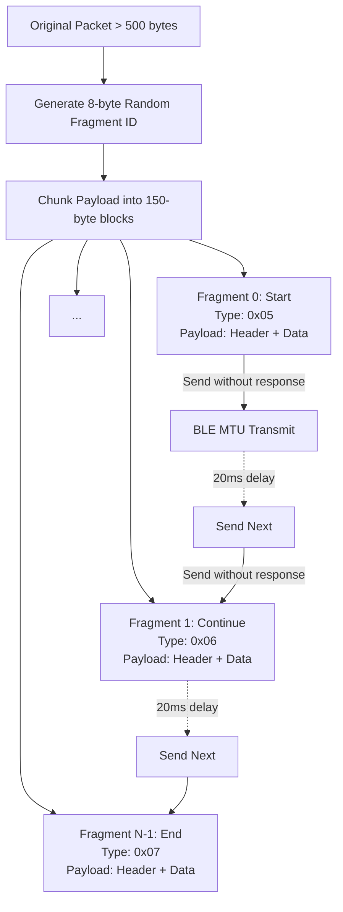
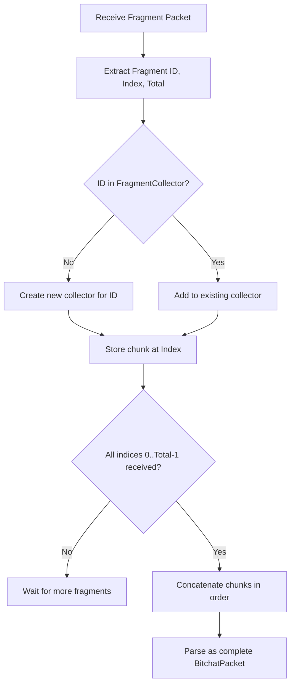

# Bitchat Protocol: Fragmentation and Reassembly

This document details the message fragmentation and reassembly mechanisms in the Bitchat protocol.

## 1. Fragmentation Constants

*   **`MAX_FRAGMENT_SIZE`**: 500 bytes — This is the threshold for deciding to fragment a packet. If the packet data is larger than this, it will be fragmented.
*   **Chunk Size**: 150 bytes — Actual payload chunk size used for each fragment, chosen conservatively for iOS BLE MTU (which is typically 185 bytes).
*   **Inter-fragment Delay**: 20ms — A sleep delay of 20 milliseconds is applied between sending consecutive fragments.

## 2. Fragment Packet Structure

When a packet is fragmented, its payload is wrapped in fragment structures. The fragment payload format includes a 13-byte metadata header followed by the actual data chunk.

### Serialization Format (13 bytes metadata + data)

1.  **Fragment ID**: 8 bytes (Random data, e.g., generated via `rand::thread_rng().fill`)
2.  **Index**: 2 bytes (Big-endian `u16`, 0-based fragment index)
3.  **Total**: 2 bytes (Big-endian `u16`, total number of fragments)
4.  **Original Type**: 1 byte (The original `MessageType` of the unfragmented packet)
5.  **Data**: Variable length (The chunk of the payload)

### Fragment Types

The outer `BitchatPacket` uses the following `MessageType` values to denote fragment packets:

*   **`FragmentStart`**: `0x05`
*   **`FragmentContinue`**: `0x06`
*   **`FragmentEnd`**: `0x07`

## 3. Fragmentation Logic

*   **Condition**: `should_fragment(packet_data)` returns `true` if the payload length strictly exceeds 500 bytes.
*   **Chunking**: The payload is split into chunks of 150 bytes.
*   **Type Assignment**:
    *   **First chunk**: Uses `FragmentStart` (`0x05`).
    *   **Middle chunks**: Use `FragmentContinue` (`0x06`).
    *   **Last chunk**: Uses `FragmentEnd` (`0x07`).
    *   *Note*: If there are exactly two fragments, the first is `Start` and the second is `End` (no `Continue`).

## 4. Sending Logic

When `send_packet_with_fragmentation` is invoked:

*   **If packet <= 500 bytes**: Sent directly as a single write.
    *   Uses `WriteType::WithoutResponse`. (Code has a check for `> 512` bytes to use `WriteType::WithResponse`, but it is logically unreachable since the fragmentation condition is `<= 500` bytes).
*   **If packet > 500 bytes**:
    *   Split into chunks (maximum 150 bytes of data per chunk).
    *   Sent sequentially with a 20ms delay (`time::sleep(Duration::from_millis(20))`) between each transmission.
    *   Uses `WriteType::WithoutResponse` for all fragments.

## 5. Reassembly Logic

*   A `FragmentReassembler` tracks in-progress assemblies grouped by `(sender_id, fragment_id)`.
*   Fragments are inserted into the collection based on their `index`.
*   **Sender Isolation**: Fragments from different senders are isolated; an attacker cannot corrupt or hijack an in-progress assembly merely by reusing a `fragment_id`.
*   **Out-of-order handling**: Fully supported. Fragments are stored by index and concatenated in strictly ascending index order once all fragments are present.
*   **Completion**: Reassembly is complete only when all indices from `0` to `total - 1` have been received.
*   Upon completion, the reassembled bytes reproduce the exact original encoded `BitchatPacket` bytes, which can then be parsed via `decode_packet`.
*   **Duplicate handling**: Identical duplicate fragments are safely ignored without memory growth; conflicting data for the same index is rejected and drops the corrupted assembly.
*   **Resource Bounds & Hardening**:
    *   `MAX_FRAGMENTS_PER_ASSEMBLY = 1000`: Protects against malicious total declarations.
    *   `MAX_ACTIVE_ASSEMBLIES = 100`: Bounds concurrent in-memory assemblies via LRU/FIFO eviction.
    *   `MAX_REASSEMBLED_BYTES = 150_000`: Protects against memory exhaustion from oversized fragment payloads.
    *   Stale assemblies can be pruned using `prune_stale(max_age_seconds)` without background timers.

## 6. Relay of Fragments

*   Each fragment is an individual packet and is relayed independently if its `TTL > 1`.
*   The `TTL` is decremented on relay (`relay_data[2] = packet.ttl - 1`).
*   Relaying uses `WriteType::WithoutResponse`.
*   A random delay of 10-50ms is applied before relaying each packet.

## 7. Concrete Example

Consider a message with a payload of 500 bytes that is subject to fragmentation (e.g., total packet data is > 500 bytes):

*   **Original packet payload**: > 500 bytes
*   **Chunk size**: 150 bytes

Fragmentation steps:
*   **Fragment 0 (Start)**: 13 bytes header + 150 bytes data = 163 bytes payload in outer packet.
*   **Fragment 1 (Continue)**: 13 bytes header + 150 bytes data = 163 bytes payload.
*   **Fragment 2 (Continue)**: 13 bytes header + 150 bytes data = 163 bytes payload.
*   **Fragment 3 (End)**: 13 bytes header + remaining bytes payload.

Each fragment is wrapped in a standard `BitchatPacket` with the respective `FragmentStart`, `FragmentContinue`, or `FragmentEnd` message type.

## Diagrams

### Fragmentation Flow

### Reassembly Flow

