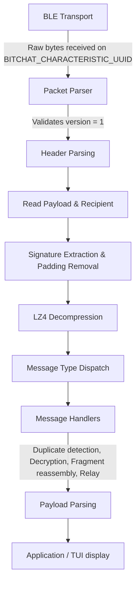

# BitChat Protocol Overview

This document provides a technical overview of the BitChat protocol (Version 1), defining its flow, components, constants, and the planned module structure for the Python reference implementation.

## Key Protocol Constants

- **Protocol Version**: `1` (wire byte)
- **Version String**: `"v1.0.0"`
- **Default TTL**: `7`
- **BLE Service UUID**: `F47B5E2D-4A9E-4C5A-9B3F-8E1D2C3A4B5C`
- **BLE Characteristic UUID**: `A1B2C3D4-E5F6-4A5B-8C9D-0E1F2A3B4C5D`
- **Broadcast Recipient ID**: `[0xFF, 0xFF, 0xFF, 0xFF, 0xFF, 0xFF, 0xFF, 0xFF]`
- **Signature Size**: `64` bytes (Ed25519)
- **Max Fragment Payload**: `500` bytes (threshold for fragmentation), `150` bytes (actual chunk payload)
- **Compression Threshold**: `100` bytes
- **Block Sizes (Padding)**: `256`, `512`, `1024`, `2048`

## Protocol Flow

The typical flow for processing inbound BitChat packets over BLE is as follows:

### Packet Processing Pipeline

1. **Packet Parser (`packet_parser.rs`)**:
   - Validates the version byte (must be `1`).
   - Parses the header: type, TTL, timestamp, flags, payload length, and sender ID.
   - Conditionally reads the recipient ID (if `FLAG_HAS_RECIPIENT` is set).
   - Reads the payload (`payload_length` bytes).
   - Conditionally reads the signature (if `FLAG_HAS_SIGNATURE` is set, `64` bytes).
   - Removes block padding (the last byte dictates the pad count).
   - Decompresses the payload if `FLAG_IS_COMPRESSED` is set (using LZ4).

2. **Message Type Dispatch**:
   - Routes the parsed packet to specific handlers based on its `MessageType`.

3. **Message Handlers (`notification_handlers.rs`, `message_handlers.rs`)**:
   - Implements duplicate detection using a Bloom Filter.
   - Updates peer discovery data.
   - Handles decryption (Noise protocol or legacy AES-GCM).
   - Reassembles fragmented packets.
   - Executes relay logic if TTL > 1 (incorporating a random 10-50ms delay).

4. **Payload Parsing (`payload_handling.rs`)**:
   - Parses the inner message format containing its own flags.
   - Extracts specific message content: ID, sender, text content, channel information, and mentions.

## Rust to Python Implementation Mapping

The following table maps the responsibilities from the Rust reference implementation to the planned Python module structure.

| Rust Module | Python Module | Responsibility |
|---|---|---|
| `data_structures.rs` | `src/bitchat/protocol/constants.py` + `src/bitchat/models/` | Protocol constants, enums (`MessageType`, `DebugLevel`, `EncryptionStatus`), structs, BLE UUIDs |
| `binary_protocol_utils.rs` | `src/bitchat/protocol/encoding.py` | Low-level binary helpers (BE encoding of u16/u32/u64, length-prefixed strings, UUIDs) |
| `binary_encoding.rs` | `src/bitchat/protocol/messages.py` | Payload struct serialization/deserialization |
| `packet_creation.rs` | `src/bitchat/protocol/packet.py` | Creates complete packets with padding and blocking |
| `packet_parser.rs` | `src/bitchat/protocol/parser.py` | Parses raw bytes into packet structures |
| `fragmentation.rs` | `src/bitchat/protocol/fragmentation.py` | Fragment/reassemble large payloads (>500 bytes, 150-byte chunks) |
| `payload_handling.rs` | `src/bitchat/protocol/payload.py` | Message payload flags and inner format parsing/creation |
| `packet_delivery.rs` | `src/bitchat/protocol/delivery.py` | ACK logic, channel announce creation, routing decisions |
| `message_handlers.rs` | `src/bitchat/app/handlers.py` | Outbound message handling (DM via Noise, legacy DM, regular/channel messages) |
| `notification_handlers.rs` | `src/bitchat/app/notifications.py` | Inbound message routing, relay logic, duplicate detection |
| `noise_protocol.rs` | `src/bitchat/crypto/noise.py` | Noise protocol state machines (`CipherState`, `SymmetricState`, `HandshakeState`) |
| `noise_session.rs` | `src/bitchat/crypto/sessions.py` | Per-peer Noise session management |
| `encryption.rs` | `src/bitchat/crypto/encryption.py` | Legacy encryption (X25519+AES-256-GCM), Ed25519 signing, key exchange, identity fingerprints |
| `compression.rs` | `src/bitchat/protocol/compression.py` | LZ4 compression (with Swift compatibility notes) |
| `persistence.rs` | `src/bitchat/storage/state.py` | JSON config state file (`~/.bitchat/state.json`), key storage |
| `main.rs` (BLE parts) | `src/bitchat/ble/` | BLE scanning, connection, GATT operations |
| `tui/` | `src/bitchat/tui/` | Terminal UI (Textual-based) |
| `main.rs` (commands) | `src/bitchat/commands/` | Slash command handling |
