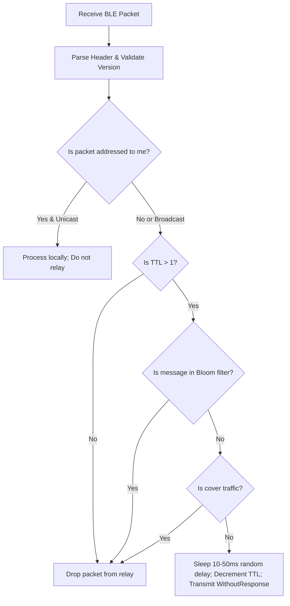

# Routing and Relay Behavior

This document specifies the routing, relay, and mesh propagation mechanisms of the BitChat protocol, extracted from the Rust reference implementation (`bitchat-tui`).

---

## 1. Network Model Overview

BitChat operates as an ad-hoc, multi-hop Bluetooth Low Energy (BLE) flood-and-relay mesh network:
- Nodes act as both terminal endpoints and store-and-forward repeaters.
- Communications occur over BLE advertisements and GATT characteristics using non-connected or connected broadcasts.
- Relaying is probabilistic flood-routing constrained by Time-to-Live (TTL) decrement counters and Bloom filter deduplication.

---

## 2. Packet Identifiers

Packets and messages are tracked and distinguished using specific identifiers:
- **`sender_id` (8 bytes):** Identifies the originator node of the packet.
- **`message_id` (UUID string / 16 bytes):** Embedded inside the inner `Message` payload; serves as the globally unique identifier for duplicate detection and delivery tracking.
- **`fragment_id` (8 bytes):** Random 8-byte token identifying a collection of fragmented frames originating from a single message.
- **`original_message_id` (16 bytes):** Carried in `DeliveryAck` and `ReadReceipt` frames to correlate acknowledgments back to the sent message.

---

## 3. Time-to-Live (TTL) Behavior

Every `BitchatPacket` contains an 8-bit `TTL` field at byte offset 2:

| Packet Category | Initial TTL Value | Rationale |
|---|---|---|
| **Default / Most Packets** | `7` | Standard reach across up to 7 BLE mesh hops |
| **Channel Announcements** | `5` | Moderate range for channel directory sharing |
| **Delivery Acknowledgments** | `3` | Short-range confirmation returned along reverse path |
| **Leave Notifications** | `3` | Localized channel departure propagation |

### TTL Processing Rules:
1. When a node receives a packet with `TTL <= 1`, it **must not** relay the packet.
2. When relaying an eligible packet, the node decrements the TTL:
   ```rust
   relay_data[2] = packet.ttl - 1;
   ```
3. When `TTL == 0`, the packet is dropped immediately.

---

## 4. Relay Mechanism and Forwarding Logic

When a node receives an incoming packet via BLE notification, it evaluates the following relay pipeline:



### Relay Parameters:
- **Delay:** A random jitter delay between **10ms and 50ms** is inserted before forwarding to avoid packet collisions on the BLE shared medium.
- **GATT Write Type:** Transmitted using `WriteType::WithoutResponse` to minimize latency and connection overhead.
- **Fragmentation Relay:** Fragments (`FragmentStart`, `FragmentContinue`, `FragmentEnd`) are relayed individually without waiting for complete message reassembly.

---

## 5. Duplicate Detection and Loop Prevention

To prevent infinite routing loops and broadcast storms:
- **Bloom Filter:** Nodes maintain an in-memory Bloom filter recording recently observed `message_id` values.
- **Deduplication Check:** Before processing or relaying any chat message or reassembled packet, the node checks if its ID is present in the Bloom filter.
- **Drop Action:** If already present, the packet is silently dropped without retransmission.
- **Reassembly Check:** Deduplication is applied both at the individual packet level and after fragmented messages are reassembled.

---

## 6. Forwarding Conditions

### Packets that MUST be forwarded (Relayed):
- Packets where `TTL > 1`.
- Packets whose `recipient_id` does NOT match the local node's `peer_id` (or broadcast packets).
- Packets whose message ID has not been seen in the Bloom filter.

### Packets that MUST NOT be forwarded:
- Packets with `TTL <= 1`.
- Duplicate packets already recorded in the Bloom filter.
- Directed unicast packets whose `recipient_id` strictly matches the local `my_peer_id`.
- Synthetic cover traffic packets (messages prefixed with `☂DUMMY☂`).

---

## 7. Broadcast vs Unicast Routing

### Broadcast Routing:
- Indicated by `recipient_id == [0xFF, 0xFF, 0xFF, 0xFF, 0xFF, 0xFF, 0xFF, 0xFF]`.
- Consumed and processed by every node that receives it.
- Relayed by all intermediate nodes as long as `TTL > 1` and not duplicated.
- Used for `Announce`, `ChannelAnnounce`, public channel `Message`, and `NoiseIdentityAnnounce`.

### Private Unicast Routing:
- Indicated by a specific 8-byte `recipient_id` matching the destination peer.
- Consumed and decrypted **only** by the matching destination node.
- Intermediate nodes relay the packet opaquely without being able to inspect encrypted contents.
- Used for direct private messages, Noise handshakes (`NoiseHandshakeInit`, `NoiseHandshakeResp`), and `DeliveryAck`.

---

## 8. Channel Routing

- Channel messages are transmitted as broadcast packets (`[0xFF; 8]`) with the `MSG_FLAG_HAS_CHANNEL` (`0x40`) bit set in the inner message payload.
- All nodes in the BLE mesh forward the channel message according to standard relay rules.
- Only nodes that have joined the named channel (and possess the channel decryption key if password-protected) will display the message in their TUI.

---

## 9. Delivery Acknowledgment Logic (`should_send_ack`)

When an incoming message is received, the node decides whether to generate a `DeliveryAck` (0x0A) response:

| Message Context | Send ACK? | Condition |
|---|---|---|
| **Private 1-on-1 Messages** | **Always** | Sent back to sender with TTL 3 |
| **Channel Messages** | **Conditional** | Sent **only if** active peers < 10 OR local user was mentioned |
| **Broadcast / Public Messages** | **Never** | Broadcast traffic is never acknowledged |

---

## 10. Peer Discovery

- **BLE Scanning:** Continuous or periodic BLE scan (default duration: 15 seconds) filtering for `BITCHAT_SERVICE_UUID` (`F47B5E2D-4A9E-4C5A-9B3F-8E1D2C3A4B5C`).
- **Presence Broadcast:** On startup or nickname change, a node broadcasts an `Announce` packet (0x01) with its nickname.
- **Reactive Key Exchange:** When a node receives an `Announce` from an unknown `sender_id`, it records the peer and immediately replies with a `KeyExchange` packet.

---

## 11. Features NOT Implemented in the Reference Implementation

The following routing capabilities are **not implemented in the reference implementation**:
- *Explicit mesh routing tables:* Not implemented in the reference implementation.
- *Dynamic route discovery protocols (e.g., AODV, DSR):* Not implemented in the reference implementation.
- *Path optimization or cost-based forwarding metrics:* Not implemented in the reference implementation.
- *Store-and-forward offline caching across extended timeframes:* Not implemented in the reference implementation.

The routing behavior is strictly **TTL-limited flooding with Bloom filter deduplication**.
