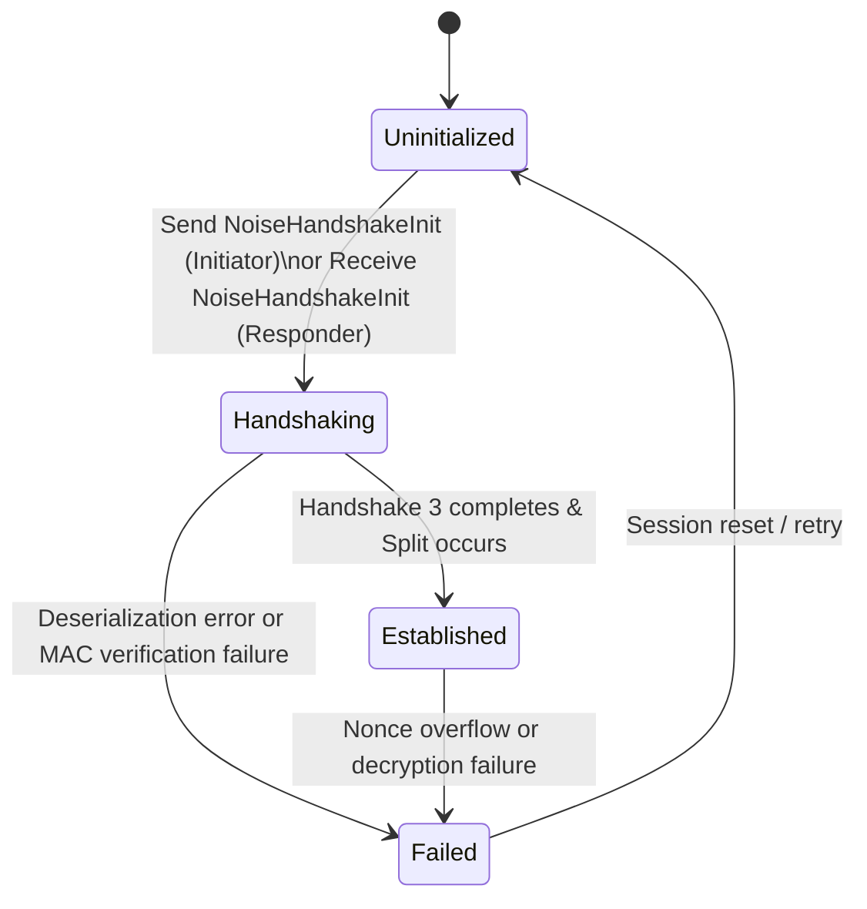

# Noise Protocol Implementation Specification

This document provides a comprehensive technical specification of the Noise Protocol integration in BitChat, extracted directly from `noise_protocol.rs` and `noise_session.rs` of the reference implementation (`bitchat-tui`).

---

## 1. Protocol Identification and Parameters

- **Full Protocol Name:** `Noise_XX_25519_ChaChaPoly_SHA256`
- **Handshake Pattern:** `XX` (Mutual authentication; no prior key knowledge required)
- **Diffie-Hellman (DH):** Curve25519 (`25519`, via `x25519-dalek`)
- **Cipher:** `ChaChaPoly` (ChaCha20-Poly1305, via `chacha20poly1305`)
- **Hash:** `SHA256` (via `sha2`)
- **Other Defined Patterns:** `IK` and `NK` are represented in the codebase enums for potential future extensions, but `XX` is universally enforced for all active sessions.

---

## 2. Key Management and Roles

### Roles:
- **`Initiator`:** The peer initiating a 1-on-1 direct message conversation. Sends Handshake Message 1 (`NoiseHandshakeInit`, `0x10`).
- **`Responder`:** The peer receiving the initial handshake request. Receives Message 1 and replies with Handshake Message 2 (`NoiseHandshakeResp`, `0x11`).

### Key Material:
- **Local Static Key:** 32-byte X25519 private scalar (`StaticSecret`), persisted across sessions in `~/.bitchat/state.json`.
- **Local Static Public Key:** 32-byte X25519 public key derived from the static secret.
- **Local Ephemeral Key Pair:** Fresh X25519 key pair generated anew for every single handshake attempt.
- **Remote Static Public Key:** 32-byte X25519 public key learned and authenticated during the handshake.
- **Remote Ephemeral Public Key:** 32-byte X25519 public key received in the handshake exchange.

---

## 3. Handshake Flow (Noise XX Pattern)

The XX handshake consists of three sequential messages:

```text
Initiator                                Responder
   |                                         |
   | -------- Message 1 (-> e) ------------> |   (MessageType::NoiseHandshakeInit, 0x10)
   |                                         |
   | <------- Message 2 (<- e, ee, s, es) -- |   (MessageType::NoiseHandshakeResp, 0x11)
   |                                         |
   | -------- Message 3 (-> s, se) --------> |   (MessageType::NoiseHandshakeResp, 0x11)
   |                                         |
[SPLIT]                                   [SPLIT]
   |                                         |
   | <==== Transport (NoiseEncrypted) =====> |   (MessageType::NoiseEncrypted, 0x12)
```

### Handshake Message Breakdown:
1. **Message 1 (`-> e`):**
   - Initiator generates ephemeral key `e`.
   - Appends `e.public_key` (32 bytes) to message.
   - Mixes `e.public_key` into symmetric state hash `h`.
   - Transmitted as `MessageType::NoiseHandshakeInit` (`0x10`).

2. **Message 2 (`<- e, ee, s, es`):**
   - Responder generates its own ephemeral key `e`.
   - Appends `e.public_key` (32 bytes) to message; mixes into `h`.
   - Performs ECDH `ee = DH(local_e, remote_e)`; mixes `ee` into chaining key `ck` via HKDF.
   - Encrypts its static public key `s` using derived cipher key; appends ciphertext (32 bytes + 16 bytes tag = 48 bytes) to message; mixes ciphertext into `h`.
   - Performs ECDH `es = DH(remote_e, local_s)`; mixes `es` into chaining key `ck` via HKDF.
   - Transmitted as `MessageType::NoiseHandshakeResp` (`0x11`).

3. **Message 3 (`-> s, se`):**
   - Initiator encrypts its static public key `s` using current cipher key; appends ciphertext (48 bytes) to message; mixes into `h`.
   - Performs ECDH `se = DH(local_s, remote_e)`; mixes `se` into `ck` via HKDF.
   - Transmitted as `MessageType::NoiseHandshakeResp` (`0x11`).

4. **Split Phase:**
   - Both parties call `symmetric_state.split()`.
   - HKDF takes chaining key `ck` and generates two 32-byte keys:
     - `send_cipher` key
     - `receive_cipher` key
   - (Initiator's send cipher is Responder's receive cipher, and vice-versa).
   - Handshake state is destroyed, and the session enters `Established`.

---

## 4. Cipher State and Nonce Handling

Each directional cipher is managed by a `NoiseCipherState`:
- **Cipher Algorithm:** ChaCha20-Poly1305.
- **Key:** 32 bytes derived from handshake split.
- **Nonce Counter:** 64-bit integer (`u64`), starting at `0`, incremented by `1` after every encrypted frame.

### Nonce Wire Format (Transport Mode):
- On the wire, transport packets prepend the **4-byte Little-Endian representation** of the nonce counter:
  ```text
  [ 4-byte LE Nonce (Offset 0..4) ][ Ciphertext + 16-byte Poly1305 Tag (Offset 4..end) ]
  ```
- **Internal Nonce Padding:** For ChaCha20-Poly1305 (which requires a 12-byte nonce), the 4-byte LE nonce is copied to bytes `4..8` of a 12-byte zeroed buffer:
  ```text
  Bytes 0..4:  0x00, 0x00, 0x00, 0x00
  Bytes 4..8:  [ 4-byte LE nonce counter ]
  Bytes 8..12: 0x00, 0x00, 0x00, 0x00
  ```

---

## 5. Replay Protection Mechanism

To prevent replay attacks over the broadcast medium:
- **Sliding Window:** Tracks the last 1024 nonces using a set/bitmask (`REPLAY_WINDOW_SIZE = 1024`).
- **High Nonce Tracking:** Records `highest_received_nonce`.
- **Validation Rules:**
  1. If `nonce > highest_received_nonce`: Accepted, advances window, marks nonce as seen.
  2. If `nonce <= highest_received_nonce`:
     - If `highest_received_nonce - nonce >= 1024`: **Rejected** (nonce too old).
     - If `nonce` is already in `replay_window`: **Rejected** (replay attempt detected).
     - Otherwise: Accepted, added to `replay_window`.
- **Warning Threshold:** Logs an alert if nonce exceeds `1_000_000_000`.

---

## 6. Session Lifecycle



### Session States:
1. **`Uninitialized`:** No session active; plain or unencrypted state.
2. **`Handshaking`:** Currently processing the 3-step XX handshake. Outgoing chat messages are placed into a `pending_messages` queue.
3. **`Established`:** Transport ciphers active. Queued pending messages are flushed and sent as `NoiseEncrypted` packets.
4. **`Failed(String)`:** Handshake or decryption failure. Records the error reason.

---

## 7. Tie-Breaking via HandshakeRequest

When two peers attempt to initiate a private conversation simultaneously:
1. A node sends a `HandshakeRequest` (0x25) packet carrying its `requester_id`.
2. Upon receipt, peers compare: `my_peer_id < request.requester_id`.
3. The peer with the **lexicographically lower peer ID** acts as the `Initiator` and sends `NoiseHandshakeInit`.
4. The peer with the higher ID yields and waits to act as `Responder`.

---

## 8. Identity Verification & Trust

- **Fingerprint:** SHA-256 hash of the peer's static X25519 public key. The canonical fingerprint format in `NoiseSessionManager` is the full 64-character lowercase hex string (or truncated to 16 bytes / 32 characters for compact UI display).
- **Trust Levels:**
  - `NoiseSecured`: Handshake succeeded and session is encrypted, but the peer's fingerprint has not been manually verified by the user.
  - `NoiseVerified`: The user has explicitly marked the peer's fingerprint as verified.

---

## 9. Python Implementation & Security Deviations

In `bitchat.crypto.noise`, the following security decisions have been made:

1. **Fail-Closed on Payload Decryption Failure:** The reference implementation continues the handshake even if payload decryption fails (noted in comments as for debugging). The Python implementation treats this as a fatal `AuthenticationError`, failing closed to prevent forged payloads.
2. **Replay Window Implementation:** A bounded `set[int]` with eviction is maintained, ensuring at most 1024 nonce counters are stored without memory growth.
3. **Transport Cipher Direction:** Confirmed matching the reference fix (lines 1235–1240):
   - Initiator: `send = c1`, `receive = c2`
   - Responder: `send = c2`, `receive = c1`

